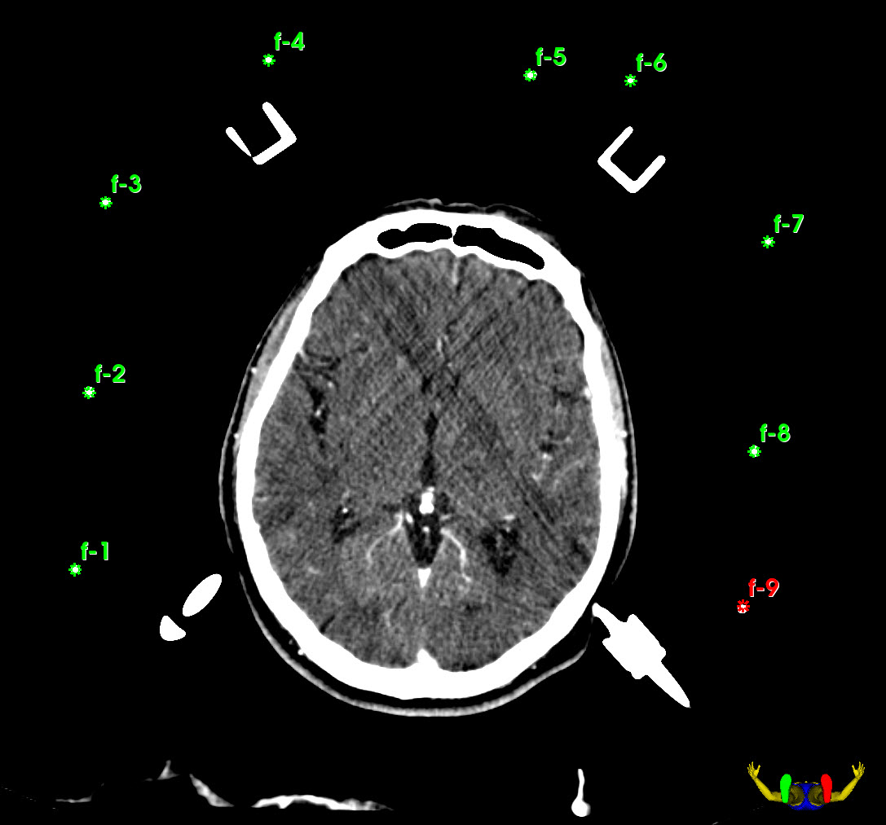

# Stereotaxia

[3DSlicer](https://www.slicer.org/) extension for computing stereotactic frame coordinates for neurosurgery planning allowing to work with stereotactic arc settings using a Micromar or Leksell Stereotactic device. 

See a short demo video for Micromar Stereotectic device [here](3dSLICER_STEREOTAXIA.mp4).
See a short demo video for Leksell Stereotectic device [here](https://tube.switch.ch/videos/ZSYNlDwMgu).

We are currently in the process of merging two independently developed applications. Consequently, there are still numerous submodules that will be reduced over time.

Modules:

- Stereotaxia: a module with graphics (stereotatic frame, volume, entry_point, target_point) that do registration and 3D coordinates conversion for neurosurgery planning. you can modify manually the frame parameters.
- StereotaxiaLite: converts 2D fiducial entry and target coordinates into 3D reference on a CT volume.
- find_zFrame_SLICERSTEREOTACTIC: Automatic detection of N-shaped markers in stereotactic CT Images. Generating the transform that will align the N-shaped markers so they "lay flat on the axial slicing plane", this has the effect of aligning the Leskell coordinate system with the coordinate system in slicer 
- probeView_SLICERSTEREOTACTIC: Reorienting slices in order to obtain "probeview".  Converting the postion of those points to patient space or image space.
- stereo_points_SLICERSTEREOTACTIC: Placing stereotactic points/trajectories with X, Y, Z, Ring, Arc settings. 

## Installation

- [Download and install 3D Slicer](https://download.slicer.org/)
- [Install `Stereotaxia` extension](https://slicer.readthedocs.io/en/latest/user_guide/extensions_manager.html#install-extensions)

## Tutorial

- Go to StereotaxiaLite module.
- Load CT with head frame. For testing, `CTHeadFrame` data set in Sample Data module can be used.
- Click `Registracion` button.
- Click on the 9 intersection points of the frame in the order shown in the image below:

- Click `Target` button and then click in the image to specify the target point.
- Click `Entry` button and then click in the image to specify the entry point on the skin.
- Computed angles are displayed in `Resultados` section

See a short demo video for Leksell Stereotectic device [here](https://tube.switch.ch/videos/ZSYNlDwMgu).

## References

Jorge Beninca, MD; Elena Zemma, MD; Dante Lovey, MD; Lucas Vera, MD; Miguel Ibáñez, MD, "Programa para la planifcación de cirugías estereotácticas" (Software for stereotactic surgery planning), NeuroTarget - Vanguardia en Neurociencia, 
Vol 11, No 4., 2017 - http://neurotarget.com/numero.php?idn=30

STEREOTACTIC: This was presented as ePoster #26250 at ESSFN 2021 in Marseille (FR) https://doi.org/10.1159/000520618.

## Financial Support

- [University of Applied Sciences and Arts Northwestern Switzerland, School of Life Sciences](https://www.fhnw.ch/en/research-and-services/lifesciences)
- [Swedish Fondation for Strategic Research, Swedish Reseach Council](https://liu.se/en/research/dbs)
